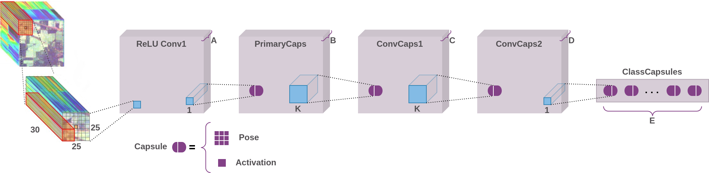
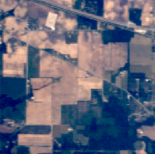
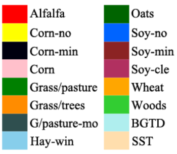
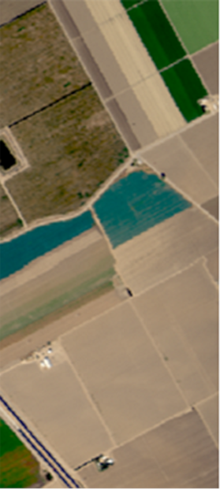
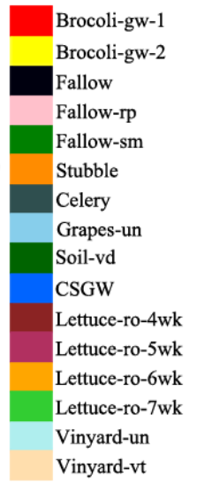
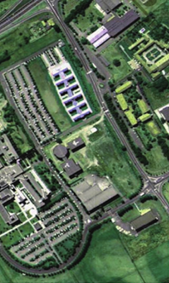
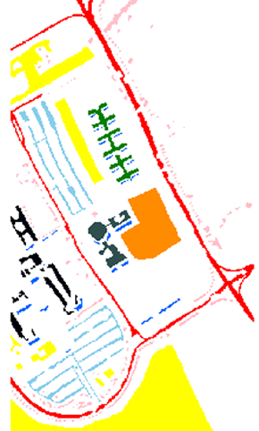
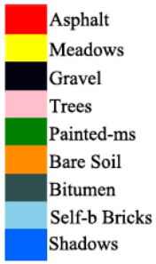

# Hyperspectral Image Classification Using Deep Matrix Capsules
[](https://opensource.org/licenses/MIT)
[](https://paperswithcode.com/sota/hyperspectral-image-classification-on-indian?p=hyperspectral-image-classification-using-deep)
[](https://paperswithcode.com/sota/hyperspectral-image-classification-on-salinas-1?p=hyperspectral-image-classification-using-deep)
[](https://paperswithcode.com/sota/hyperspectral-image-classification-on-pavia?p=hyperspectral-image-classification-using-deep)

## Link to Paper
[Hyperspectral Image Classification Using Deep Matrix Capsules](https://ieeexplore.ieee.org/document/10028853)
## Description
Deep Matrix Capsules is based on the concept of matrix capsules with Expectation-Maximization (EM) routing algorithm which is specifically designed to accommodate the nuances in the HSI data to efficiently tackle the aforementioned problems. The capsule units enable effective identification of spectral siguatures and part-whole relationships in the data while EM routing ensures viewpoint-invariance.
## Model

Deep Matrix Capsules Architecture for HSI Classification
## Prerequisites
- [PyTorch v1.6.0](https://pytorch.org/)
- [Python v3.9](https://www.python.org/)
- [Scikit Learn v1.1](https://scikit-learn.org/stable/)
- [Numpy v1.20](https://pypi.org/project/numpy/)
## Results
### Indian Pines
   

Fig: The Indian Pines dataset classification result (Overall Accuracy 99.93%) of Deep Matrix Capsules using 50% samples for training. (a) RGB Composition. (b) Ground-truth classification Map. (c) Classification map corresponding to Deep Matrix Capsules. (d) Class legend. 

### Salinas Scene
   

Fig: The Salinas Scene dataset classification result (Overall Accuracy 100.00%) of Deep Matrix Capsules using 50% samples for training. (a) RGB Composition. (b) Ground-truth classification Map. (c) Classification map corresponding to Deep Matrix Capsules. (d) Class legend.

### University of Pavia
   

Fig: The University of Pavia dataset classification result (Overall Accuracy 99.99%) of Deep Matrix Capsules using 50% samples for training. (a) RGB Composition. (b) Ground-truth classification Map. (c) Classification map corresponding to Deep Matrix Capsules. (d) Class legend.

## Citation
```
@INPROCEEDINGS{10028853,
  author={Ravikumar, Anirudh and Rohit, P N and Nair, Mydhili K and Bhatia, Vimal},
  booktitle={2022 International Conference on Data Science, Agents & Artificial Intelligence (ICDSAAI)}, 
  title={Hyperspectral Image Classification Using Deep Matrix Capsules}, 
  year={2022},
  volume={01},
  number={},
  pages={1-7},
  doi={10.1109/ICDSAAI55433.2022.10028853}}
```

## Acknowledgement
The following repositories were used for this work
- [Matrix Capsules using PyTorch](https://github.com/yl-1993/Matrix-Capsules-EM-PyTorch)
- [HybridSN](https://github.com/gokriznastic/HybridSN)
- [HSI - Traditional to Deep Models](https://github.com/AnkurDeria/HSI-Traditional-to-Deep-Models)
- [SpectralNET](https://github.com/tanmay-ty/SpectralNET)
- [HSI Classification](https://github.com/eecn/Hyperspectral-Classification)
- [Double-Branch Dual-Attention Mechanism Network](https://github.com/lironui/Double-Branch-Dual-Attention-Mechanism-Network)

## License
Copyright (c) 2023 Rohit P N and Anirudh Ravikumar. Released under the MIT License. See [LICENSE](LICENSE) for details.
